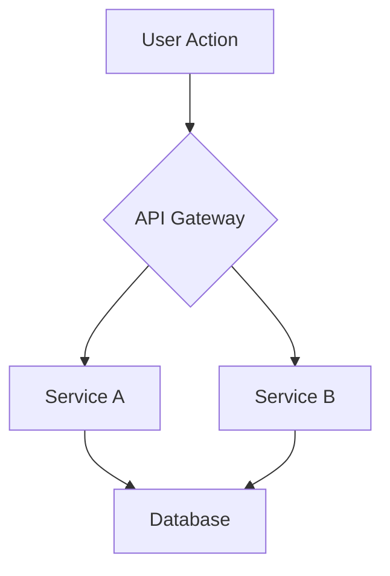

# Project Architecture

## 1. Core Principles
> **Instruction to the Developer:** List the fundamental rules that govern this system's design. These are high-level goals that the SpecPilot agent will use to validate your implementation.
>
> *Examples: "Security: All user data will be encrypted at rest," "Performance: API responses must be under 200ms," "Simplicity: Prefer simple, well-understood technologies over complex, novel ones."*

## 2. System Overview
> **Instruction to the Developer:** Provide a high-level description of the system's components and how they interact. Explain the primary user flow and the main data models.

## 3. Component Diagrams
> **Instruction to the Developer:** Use Mermaid.js syntax to visually represent the architecture. This is critical for the AI to understand the system's structure.

### 3.1 High-Level Flowchart

## 4. Approved Architectural Deviations Log
> **Instruction to the Developer:** This table is automatically updated by the SpecPilot agent when you use the "Pragmatic Escape Hatch" in Vibe Mode. It tracks intentional, temporary violations of the architectural principles.

| Task | Rule Violated | Rationale | Resolution Phase |
|------|---------------|-----------|------------------| 