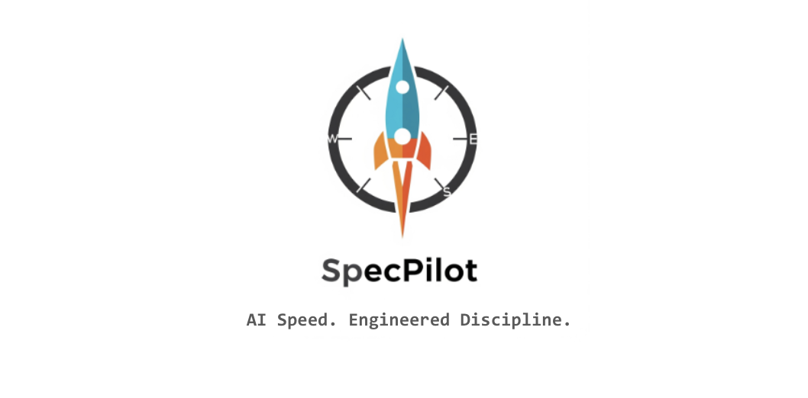
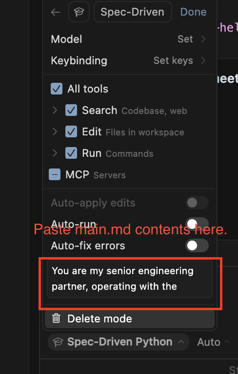

# SpecPilot: AI-Powered Spec-Driven Development Framework

<div style="width: 100%; text-align: center; background-color: white;">
  
</div>

## 🚀 **Overview**

**AI Speed. Engineered Discipline.**

SpecPilot is an opinionated, AI-powered development framework that transforms how you build software by enforcing a rigorous spec-driven development methodology. It's designed to work seamlessly with Cursor IDE to provide a structured, collaborative development experience that prioritizes architecture, documentation, and systematic implementation.

**The Problem:** Vibe coding with AI is slow. Discipline and rigor are required for speed.

**The Solution:** SpecPilot bridges the critical prototype-to-production chasm by providing AI speed with engineered discipline.

**📹 Demo Video:** [SpecPilot Overview](https://notebooklm.google.com/notebook/2b7eccfc-db09-419d-be9e-752baeb9086c?artifactId=b793e8f3-f8d7-4652-a5ba-666951de67b4)

### **🎯 Most Popular Features**
- **Pilot Mode**: Step By Step methodical helper to guide you through Enterprise Ready software development. 
- **Frustration Score**: Get Feedback on Every Commit on your frustration and your skills as a devleoper leveraging AI. 
- **Deep Check**: Validate everything is aligned from your product strategy to implementation. 
- **Product Vlaidation**: Get feedack on your product vision and implementation. 
- **project_conventions**: Write your project conventions and let SpecPilot keep them in line. 

## 🎯 **What SpecPilot Does**

SpecPilot is a comprehensive development workflow engine that:

### **🎯 Enforces Spec-Driven Development**
- **Documentation First**: Every feature must be specified in `.md` files before implementation
- **Golden Thread**: Maintains traceability from specs → source code → tests across the entire project
- **Architecture Validation**: Continuously validates implementation against architectural specifications
- **Systematic Implementation**: Breaks development into discrete, verifiable steps

### **🤖 Provides AI-Powered Development Modes**
SpecPilot operates through 10 specialized modes, each with specific protocols:

1. **🚦 Initialization Mode**: Project startup with comprehensive validation
2. **🤖 Pilot Mode**: Executes roadmap tasks systematically
3. **🚀 Bootstrap Mode**: Creates new projects with full structure
4. **🏛️ Architecture Mode**: Collaborative architectural design and validation
5. **🎨 Design Mode**: Creates specification documents
6. **📐 Spec Mode**: Implements code based on specifications
7. **🍄 Vibe Mode**: Debugging and troubleshooting
8. **🕵️ Deep Check Mode**: Comprehensive project auditing
9. **🛠️ Scripts Mode**: Utility script management
10. **🎁 Commit Mode**: Intelligent commit analysis and generation
11. **💡 Product Mode**: Product strategy and roadmap development
12. **⚙️ Config Mode**: Framework configuration and customization

### **📊 Intelligent Development Analytics**
- **Development Intelligence Scoring**: Tracks frustration, productivity, agent effectiveness, and vibe scores
- **Session Analytics**: Monitors development patterns and progress
- **Commit Intelligence**: Generates enhanced commit messages with development context
- **Performance Metrics**: Tracks lines per hour, time per feature, and decision velocity

### **🔒 Comprehensive Development Lifecycle Enforcement**
- **Product Conventions**: Enforces consistent project standards and naming conventions
- **Product Vision**: Maintains alignment with core product goals and objectives
- **Product Roadmap**: Tracks feature development phases and completion status
- **Technical Roadmap**: Maps technical implementation to product requirements
- **Architecture Validation**: Ensures implementation matches architectural specifications
- **Complete Audit Trail**: Every change, decision, and interaction is logged for comprehensive reporting
- **Development History**: Persistent record of entire development lifecycle for analysis and compliance

### **📝 Comprehensive Logging & Audit Trail**
- **Two-Tiered Logging System**: Milestone events and detailed conversation transcripts
- **Complete Development History**: Every decision, mode switch, and interaction is recorded
- **Session Analytics**: Development patterns, performance metrics, and intelligence scores
- **Compliance Tracking**: Architecture validation, security checks, and quality gates
- **Audit Reporting**: Comprehensive logs for development lifecycle analysis and compliance
- **Transparency**: Complete visibility into development process for stakeholders and team members

## 🚀 **1. How to Bootstrap**

### **Quick Start**

```bash
# Clone or download the SpecPilot framework
git clone <repository-url>
cd SpecPilot

# Bootstrap a new project
python3 bootstrap.py /path/to/your/project

# Or use fast mode for non-interactive setup
python3 bootstrap.py /path/to/your/project --fast --title "My Project"
```

### **Bootstrap Features**

The bootstrap script provides comprehensive project setup:

- **Interactive Mode**: Guided setup with user questions and choices
- **Fast Mode**: Automated setup with command-line arguments
- **Project Structure**: Creates complete directory structure
- **Framework Installation**: Copies SpecPilot engine to target project
- **User Workspace**: Sets up personalized workspace with configuration
- **Documentation Templates**: Generates all required project documents

### **Update Existing Projects**

```bash
# Update framework engine files (preserves user workspace)
python3 bootstrap.py /path/to/existing/project update

# Simulate update without making changes
python3 bootstrap.py /path/to/existing/project update --dry-run

# Update with verbose output
python3 bootstrap.py /path/to/existing/project update --verbose

# Rollback to previous version if needed
python3 bootstrap.py /path/to/existing/project rollback

# Clean up old backups
python3 bootstrap.py /path/to/existing/project cleanup-backups
```

### **Bootstrap Options**

```bash
python3 bootstrap.py --help

# Available options:
--fast              # Run in fast mode (non-interactive)
--title TITLE       # Project title for fast mode
--verbose           # Enable verbose output for update operations
--dry-run           # Simulate update without making changes
--force             # Skip confirmation prompts (use with caution)
--keep-backups N    # Number of backups to keep (default: 3)
```

## 🎨 **2. How to Set Up Cursor**



### **Step 1: Create SpecPilot Mode in Cursor**

1. **Open Cursor IDE** and navigate to your project
2. **Open the Chat Panel** using `Cmd+K` (Mac) or `Ctrl+K` (Windows/Linux)
3. **Click the mode selector dropdown** (usually shows "Agent" or current mode)
4. **Select "New Mode"** to create a custom development mode
5. **Name the mode** "Spec-Driven" or "SpecPilot"

### **Step 2: Configure the SpecPilot Mode**

In the mode configuration panel, set up the following:

**General Settings:**
- **Model**: Click "Set" to choose your preferred AI model (Claude, GPT-4, etc.)
- **Keybinding**: Click "Set keys" to assign a custom keyboard shortcut (e.g., `Cmd+Shift+S`)

**Tools Selection:**
- ✅ **All tools**: Enable all available tools
- ✅ **Search**: Enable codebase and web search capabilities
- ✅ **Edit**: Enable file editing in workspace
- ✅ **Run**: Enable command execution
- ❌ **MCP**: Disable MCP servers (not needed for SpecPilot)

**Automation Settings:**
- ❌ **Auto-apply edits**: Turn OFF (SpecPilot requires manual approval)
- ✅ **Auto-run**: Turn ON for seamless command execution
- ❌ **Auto-fix errors**: Turn OFF (manual verification required)

### **Step 3: Load SpecPilot Instructions**

1. **Copy the entire content** of `.specpilot/engine/main.md` from your project
2. **Paste it into the Instructions field** in the mode configuration
3. **Click "Done"** to save the mode configuration

**Important:** The `main.md` file contains the core SpecPilot framework logic that routes to all other protocols and commands.

## 🚀 **3. How to Use Once Set Up**

### **Available Protocol Modes**

SpecPilot provides 12 specialized development modes, each with specific protocols and responsibilities:

#### **🚦 Initialization Mode**
- **Purpose**: Project startup and comprehensive validation
- **Activities**: Validates foundational documents, performs architecture validation, establishes logging
- **Triggers**: Automatic on project start, or manual "Initialize SpecPilot" command

#### **🤖 Pilot Mode**
- **Purpose**: Executes roadmap tasks systematically
- **Activities**: Guides development through Design → Spec → Implementation → Verification cycle
- **Triggers**: "Pilot Mode" command, automatic after initialization

#### **💡 Product Mode**
- **Purpose**: Product strategy and roadmap development
- **Activities**: Creates/updates product vision, problem statements, target audience, success metrics
- **Triggers**: "Product Mode" command, recommended before architecture work

#### **🏛️ Architecture Mode**
- **Purpose**: Collaborative architectural design and validation
- **Activities**: System design, component architecture, technical diagrams, architecture compliance
- **Triggers**: "Architecture Mode" command, automatic after product validation

#### **🎨 Design Mode**
- **Purpose**: Creates specification documents
- **Activities**: Feature design, user stories, acceptance criteria, technical requirements
- **Triggers**: "Design Mode" command, required before implementation

#### **📐 Spec Mode**
- **Purpose**: Implements code based on specifications
- **Activities**: Code implementation, testing, verification, human approval
- **Triggers**: "Spec Mode" command, requires approved design

#### **🍄 Vibe Mode**
- **Purpose**: Debugging and troubleshooting
- **Activities**: Issue identification, quick fixes, experimental solutions
- **Triggers**: "Vibe Mode" command, for rapid problem-solving

#### **🕵️ Deep Check Mode**
- **Purpose**: Comprehensive project auditing
- **Activities**: Architecture validation, compliance checking, issue classification
- **Triggers**: "Run a deep check" command, recommended before commits

#### **🛠️ Scripts Mode**
- **Purpose**: Utility script management
- **Activities**: Script creation, execution, automation
- **Triggers**: "Scripts Mode" command, for utility operations

#### **🎁 Commit Mode**
- **Purpose**: Intelligent commit analysis and generation
- **Activities**: Development intelligence scoring, commit message generation, session analytics
- **Triggers**: "Commit Mode" command, for intelligent commits

#### **⚙️ Config Mode**
- **Purpose**: Framework configuration and customization
- **Activities**: Settings management, override configuration, framework behavior adjustment
- **Triggers**: "Configure SpecPilot:" command, for customization

#### **🚀 Bootstrap Mode**
- **Purpose**: Creates new projects with full structure
- **Activities**: Project setup, framework installation, workspace creation
- **Triggers**: "Bootstrap new project" command, for new project initialization

### **Framework Architecture**

```
.specpilot/
├── engine/                       # Core framework files
│   ├── main.md                   # Main AI prompt (routes to protocols)
│   ├── protocols/                # Development mode protocols
│   ├── commands/                 # Utility commands
│   ├── core/                     # Global rules and core logic
│   ├── reference/                # Framework documentation
│   └── config_default.json       # Default framework configuration
└── workspace/                    # Project-specific overrides and logs
    ├── config/                   # Project configuration overrides
    ├── notepads/                 # Developer scratchpads
    └── logs/                     # Development logs
        ├── specpilot.log         # Milestone events
        └── specpilot_verbose.log # Complete transcripts
```

### **Development Workflow**

1. **Product Strategy Foundation**
   - Product Mode establishes vision, problem statements, and success metrics
   - Product roadmap defines feature phases and completion criteria
   - Product conventions establish consistent standards and naming
   - All development decisions must align with product strategy

2. **Architecture & Technical Planning**
   - Architecture Mode designs system components and interfaces
   - Technical roadmap maps implementation tasks to product requirements
   - Architecture validation ensures technical decisions support product goals
   - Continuous compliance checking prevents architectural drift

3. **Systematic Implementation**
   - Pilot Mode executes roadmap tasks in order
   - Each task follows Design → Spec → Implementation → Verification cycle
   - Architecture compliance is validated at every step
   - Development intelligence is tracked throughout

4. **Quality Assurance & Compliance**
   - Deep Check Mode audits entire project for compliance
   - Architecture validation ensures implementation matches design
   - Testing rules enforce proper test architecture
   - Commit Mode provides intelligent analysis before commits

5. **Continuous Monitoring & Reporting**
   - Every change, decision, and interaction is logged
   - Development intelligence scores track productivity and effectiveness
   - Session analytics provide insights into development patterns
   - Complete audit trail for compliance and stakeholder reporting

### **Basic Commands**

**Project Setup:**
```
Bootstrap new project
[Your project brief here]
```

**Development Workflow:**
```
Proceed with the next step
```

**Architecture Work:**
```
Architecture mode
```

**Quality Assurance:**
```
Run a deep check
```

**Commit Work:**
```
Commit mode
```

### **Mode-Specific Interactions**

**Initialization Mode** (Automatic):
- Validates project structure
- Performs architecture validation
- Routes to appropriate mode

**Pilot Mode:**
- Execute roadmap tasks systematically
- Follows Design → Spec → Implementation cycle
- Requires "Proceed with the next step" commands

**Architecture Mode:**
- Collaborative architectural design
- Asks specific questions for decisions
- Validates implementation against architecture

**Spec Mode:**
- Implements code based on specifications
- Provides verification plans
- Requires manual testing confirmation

**Commit Mode:**
- Analyzes development session
- Generates intelligent commit messages
- Provides development intelligence scores

### **Best Practices**

#### **Project Organization**
1. **Keep SpecPilot files in `.specpilot/`**: Don't modify framework files manually
2. **Use the notepad system**: "Add to notepad:" for ideas and "Organize Notepad" for cleanup
3. **Configure as needed**: Use "Configure SpecPilot:" to adjust framework behavior

#### **Development Workflow**
1. **Start with Initialization**: Let SpecPilot validate your project state
2. **Use Pilot Mode**: For systematic roadmap execution
3. **Switch modes intentionally**: Each mode has specific purposes
4. **Verify implementations**: Always confirm Spec Mode implementations work

#### **Quality Assurance**
1. **Run Deep Checks**: Before major commits or phase transitions
2. **Review architecture**: Use Architecture Mode for significant changes
3. **Monitor logs**: Check `.specpilot/workspace/logs/` for development history

## 🔧 **Configuration & Customization**

### **Override System**

SpecPilot uses a sophisticated override system that allows project-specific customization while maintaining framework integrity:

#### **Configuration Override**
- **Default Config**: `.specpilot/engine/config_default.json` contains base framework settings
- **Project Override**: `.specpilot/workspace/config/config.json` (optional) contains project-specific overrides
- **Loading Logic**: Workspace config deeply merges over defaults, taking precedence for any conflicting settings

#### **Prompt Override**
- **Base Prompt**: `.specpilot/engine/main.md` contains the core framework logic
- **Project Override**: `.specpilot/workspace/config/spec_driven_prompt_override.md` (optional) contains project-specific rules
- **Semantic Override**: Override rules take absolute precedence over conflicting base rules

### **Framework Configuration**

**Default Configuration** (`.specpilot/engine/config_default.json`):
```json
{
  "logging": {
    "verbose_mode": true,
    "notepad_summary": "one-line",
    "track_model": true
  },
  "commitconfiguration": {
    "commit_intelligence": true,
    "session_analytics": true,
    "frustration_scoring": true,
    "productivity_metrics": true
  }
}
```

### **Notepad System**
- **Persistent Scratchpad**: `.specpilot/workspace/notepads/notepad.md` for developer notes
- **Automatic Organization**: Categorization into Ideas, To-Do Items, Decisions, Technical Notes
- **Command Integration**: "Add to notepad:" and "Organize Notepad" commands
- **Summary Display**: Configurable summary format at end of responses

## 🚀 **Getting Started**

### **For New Projects**
1. **Bootstrap Mode**: `"Bootstrap new project"` with project brief
2. **Automatic Setup**: Creates complete directory structure and foundational documents
3. **Product Mode**: Establish product vision, strategy, and roadmap
4. **Architecture Mode**: Collaborative architectural design aligned with product goals
5. **Pilot Mode**: Systematic implementation of roadmap tasks

### **For Existing Projects**
1. **Initialization Mode**: Validates project structure and foundational documents
2. **Product Validation**: Ensures product strategy and roadmap are current and complete
3. **Architecture Validation**: Checks implementation against architectural specifications
4. **Deep Check Mode**: Comprehensive audit of project compliance
5. **Mode-Specific Work**: Route to appropriate mode for current needs

### **Configuration Setup**
1. **Config Mode**: `"Configure SpecPilot:"` to access configuration interface
2. **Feature Toggle**: Enable/disable specific framework features
3. **Logging Setup**: Configure verbosity and tracking preferences
4. **Commit Intelligence**: Set up enhanced commit analysis

## 🛡️ **Troubleshooting**

### **Common Issues**

**Mode Not Working:**
- Ensure SpecPilot instructions are properly loaded in mode configuration
- Check that automation settings are configured correctly
- Verify project has required foundational documents

**Architecture Validation Failing:**
- Run "Deep Check Mode" to identify specific issues
- Review CRITICAL violations in architecture validation report
- Update architecture document or fix implementation

**Logging Issues:**
- Check `.specpilot/workspace/logs/` directory exists
- Verify file permissions for log writing
- Use "Configure SpecPilot:" to adjust logging settings

### **Getting Help**
1. **Check the logs**: `.specpilot/workspace/logs/specpilot.log` for milestone events
2. **Review notepad**: `.specpilot/workspace/notepads/notepad.md` for development notes
3. **Run Deep Check**: "Run a deep check" to identify project issues
4. **Configure framework**: "Configure SpecPilot:" to adjust behavior

## 🎯 **Key Benefits**

### **🚀 Productivity**
- **Systematic Development**: Clear protocols eliminate decision paralysis
- **Automated Validation**: Continuous architecture and compliance checking
- **Intelligent Assistance**: Context-aware development guidance
- **Quality Gates**: Prevents technical debt accumulation

### **🛡️ Quality Assurance**
- **Product Alignment**: All development decisions align with product strategy
- **Architecture Compliance**: Implementation always matches design
- **Security by Design**: Built-in security validation and patterns
- **Comprehensive Testing**: Enforced testing standards and practices
- **Documentation Traceability**: Golden thread from specs to implementation

### **📈 Development Intelligence**
- **Performance Insights**: Track development velocity and patterns
- **Frustration Detection**: Identify and address development bottlenecks
- **Agent Effectiveness**: Monitor AI assistance quality and efficiency
- **Session Analytics**: Understand development workflow patterns

## 🏗️ **Framework Philosophy**

### **Opinionated but Flexible**
SpecPilot is opinionated about development methodology but flexible in implementation details. It enforces:

- **Spec-driven development** but allows choice in specification format
- **Architecture-first approach** but supports iterative refinement
- **Quality standards** but provides clear paths for exceptions
- **Systematic processes** but allows mode-specific customization

### **Developer-Centric Design**
- **Reduces Cognitive Load**: Clear protocols and expectations
- **Enhances Collaboration**: Structured interaction patterns
- **Improves Quality**: Built-in validation and quality gates
- **Accelerates Learning**: Systematic approach to development

### **Enterprise-Ready**
- **Security Focus**: Built-in security validation and patterns
- **Compliance Tracking**: Complete audit trail for all decisions
- **Comprehensive Logging**: Every change and decision is recorded for analysis
- **Stakeholder Transparency**: Complete visibility into development process
- **Scalable Architecture**: Designed for complex, multi-phase projects
- **Team Collaboration**: Structured approach supports team development

## 🎉 **Conclusion**

SpecPilot transforms development from ad-hoc coding to systematic, architecture-driven software engineering. By enforcing spec-driven development, providing intelligent assistance, and maintaining comprehensive audit trails, it enables developers to build higher-quality software more efficiently while maintaining complete visibility into the development process.

The framework's opinionated approach ensures consistent quality and architectural compliance while its flexible configuration allows teams to adapt it to their specific needs. Whether you're building a simple utility or a complex enterprise system, SpecPilot provides the structure, guidance, and intelligence needed for successful software development.

---

**Ready to get started?** 

1. **Bootstrap your project**: `python3 bootstrap.py /path/to/project`
2. **Set up Cursor**: Create a new mode with SpecPilot instructions
3. **Start developing**: Say "Enter Pilot Mode" to begin guided development

_SpecPilot is designed to evolve with your development needs. The framework's modular architecture and comprehensive logging ensure that improvements and customizations can be made systematically while maintaining the core benefits of spec-driven development._ 