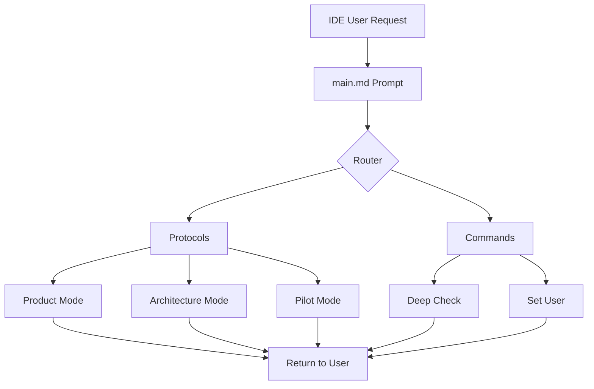
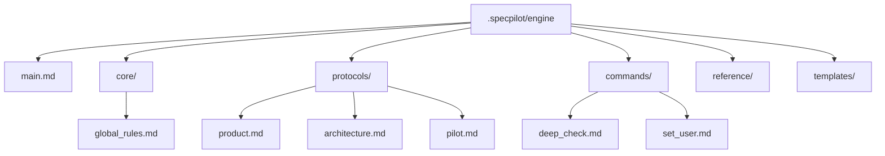

# Project Architecture

## 1. Core Principles

**Logging Architecture**: All Mode Switches, Commands and Mode Switches requires logging setup in logging_rules.md

**Protocol Validation Self-Containment**: Each protocol mode must define its own validation rules and criteria for completeness within its protocol file. Validation logic should not be externalized to other modes or components. Each mode is responsible for defining what constitutes "complete," "valid," and "ready" for its specific domain (e.g., Product Mode defines product strategy validation, Architecture Mode defines architecture completeness, etc.).

**Directory Structure & Separation of Concerns**: The SpecPilot framework operates on a strict, multi-layered directory structure designed to enforce a clear separation of concerns. This architecture separates the Framework Engine (the tool itself) from the User Workspace (the project's state) and the Project Artifacts (the code and documentation being built).

1. **The .specpilot/ Directory: The Framework Container**
   This hidden directory at the root of the project is the exclusive container for all SpecPilot-related files. It is divided into two primary, conceptually distinct subdirectories: engine and workspace.

   **.specpilot/engine/ (Read-Only Core)**
   - Purpose: This is the core, distributable engine of the SpecPilot framework. It contains all the prompts, protocols, and commands that define the agent's behavior.
   - Rule: This directory should be treated as read-only during normal development. Its contents should only be modified when upgrading or fundamentally changing the SpecPilot methodology itself.
   - Separation of Concerns:
     - main.md: The single entry point and Orchestrator prompt. Its sole responsibility is to load other components in the correct sequence.
     - core/: Contains the universal, foundational truths of the framework, such as global_rules.md.
     - protocols/: Contains the self-contained playbooks for each stateful Mode (e.g., pilot.md, architecture.md).
     - commands/: Contains the playbooks for stateless, universal Commands (e.g., deep_check.md, set_user.md).
     - reference/: A library of static documents that protocols and commands read from for detailed instructions (e.g., logging_rules.md).
     - templates/: A library of boilerplate files that the framework copies from during processes like Bootstrap Mode (e.g., architecture.md template).
     - config_default.json: The safe, fallback configuration for the framework.

   **.specpilot/workspace/ (Read-Write User State)**
   - Purpose: This directory contains the dynamic, user-specific state of the project. It is where all the outputs of the development process are stored. These files are meant to be checked into version control to provide a complete history of the project's evolution.
   - Rule: The workspace is namespaced by user directories (e.g., cwagner/, jdoe/) to prevent merge conflicts in a collaborative environment.
   - Separation of Concerns:
     - [username]/config.json: The user's personal overrides for the framework's behavior.
     - [username]/directives.md: The user's high-priority, custom rules that modify the agent's behavior for this specific project.
     - [username]/logs/: Contains the complete, chronological history of all development actions and conversations. Critical for Commit Mode and Session Check.
     - [username]/notepads/: Contains the user's personal scratchpads for ideas and tasks.

2. **The .specpilot.local File: Local Machine Configuration**
   - Purpose: This file, located at the project root, stores configuration that is specific to a developer's local machine and should never be checked into version control.
   - Rule: Its primary purpose is to store the username, providing a reliable way to identify the user that is independent of the machine's environment. This file MUST be included in the project's .gitignore.

3. **Project Artifacts (docs/, src/, tests/)**
   - Purpose: These are the actual outputs of the development process—the application itself.
   - Rule: The SpecPilot framework reads from and writes to these directories, but they are not part of the framework's internal structure. The framework's intelligence (e.g., Deep Check) is derived from analyzing the relationships between the files in these directories (e.g., ensuring a file in src/ has a corresponding spec in docs/specs/).

*(Additional fundamental rules that govern this system's design. Examples: "Security: All user data will be encrypted at rest," "Performance: API responses must be under 200ms," "Simplicity: Prefer simple, well-understood technologies over complex, novel ones.")*

## 2. System Overview

The SpecPilot framework operates as an AI-powered development methodology engine that integrates with IDEs like Cursor through a copy-paste prompt system.

### Primary User Flow
1. **IDE Integration**: When an IDE like Cursor bootstraps a project, it uses a copy-pasted prompt from the `main.md` file in the `.specpilot/engine` directory
2. **Routing**: The prompt is then routed to an appropriate protocol or command within the engine based on user requests
3. **Execution**: The selected protocol or command executes its specialized workflow and returns control to the user

### Main Data Models
- **Framework Engine**: Contains all protocols, commands, and core rules
- **User Workspace**: Project-specific state, logs, and configuration
- **Project Artifacts**: Application code, documentation, and specifications

## 3. Component Architecture

All components are contained within the `.specpilot/engine` directory:

### Core Components
- **`main.md`**: Entry point prompt that gets copied into IDEs
- **`core/`**: Global rules and override system that loads user overrides
- **`protocols/`**: Different protocol engines for various development modes (Product, Architecture, Pilot, etc.)
- **`commands/`**: Specific commands the IDE can leverage for utility operations
- **`reference/`**: Static documentation and rules
- **`templates/`**: Boilerplate files for project setup

### Component Responsibilities
- **Router**: `main.md` handles initial request routing to appropriate protocols or commands
- **Protocol Engine**: Each protocol file contains self-contained validation rules and workflow logic
- **Command Engine**: Commands provide stateless utility operations across all modes
- **Core Rules**: Global rules establish framework behavior and can be overridden by user directives

## 4. Component Diagrams

### 4.1 High-Level Framework Flow

### 4.2 Component Architecture

## 5. Security Architecture

Security is not applicable for this framework project. For user projects, security considerations can be added to their individual `architecture.md` files based on their specific requirements and deployment context.

## 6. Performance Architecture

Performance is not applicable for this framework project. The framework operates as a prompt-based system where performance is determined by the underlying AI model and IDE integration, not by framework-specific optimizations.

## 7. Approved Architectural Deviations Log

| Task | Rule Violated | Rationale | Resolution Phase |
|------|---------------|-----------|------------------|
| Framework-only architecture | Traditional application component patterns | This is a development methodology framework, not an application | Complete - Framework architecture is appropriate |

*Note: This framework operates differently from traditional applications, focusing on prompt-based development guidance rather than runtime execution.* 